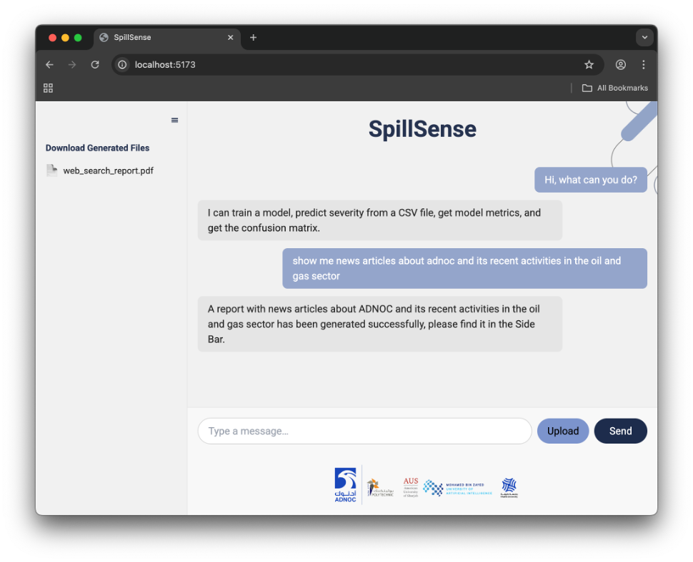
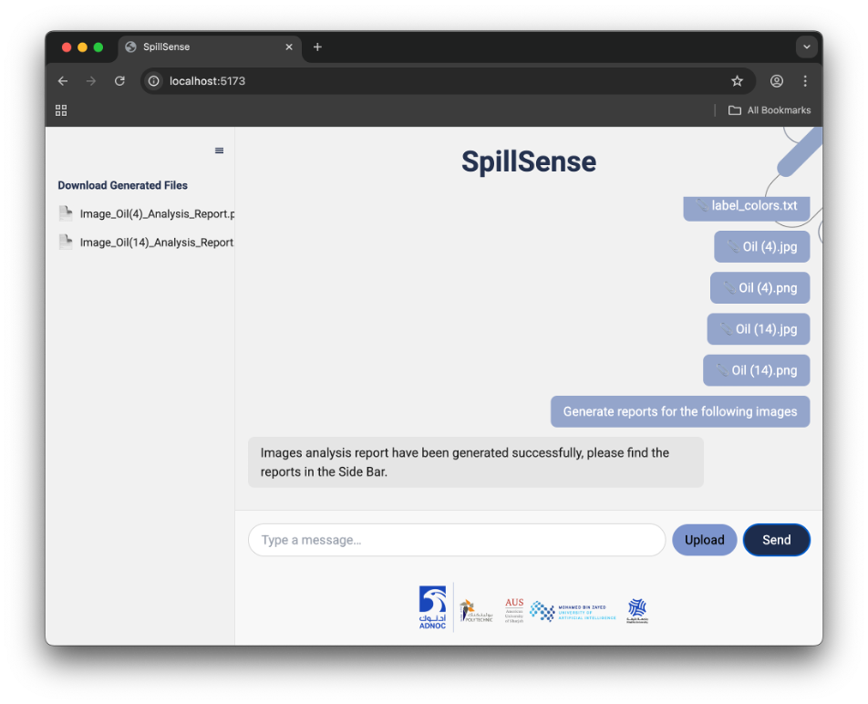
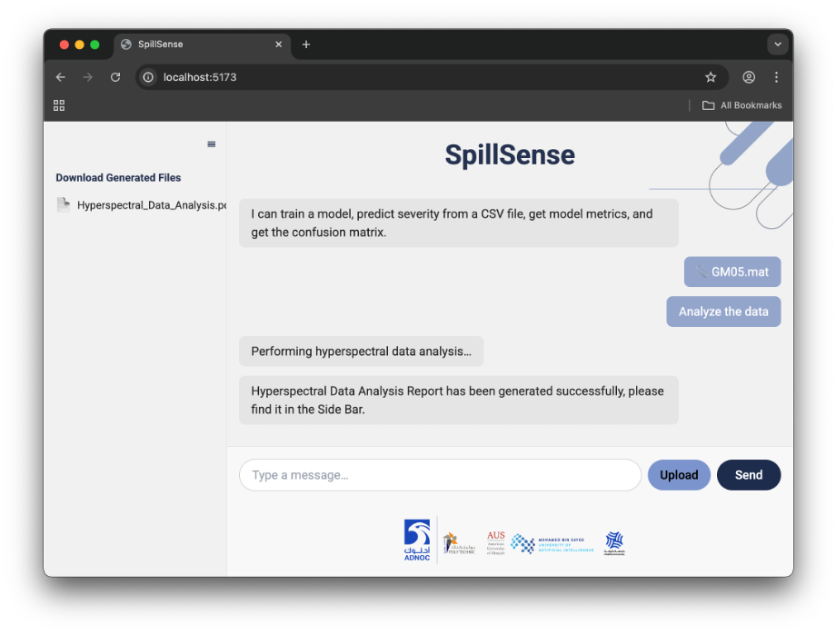
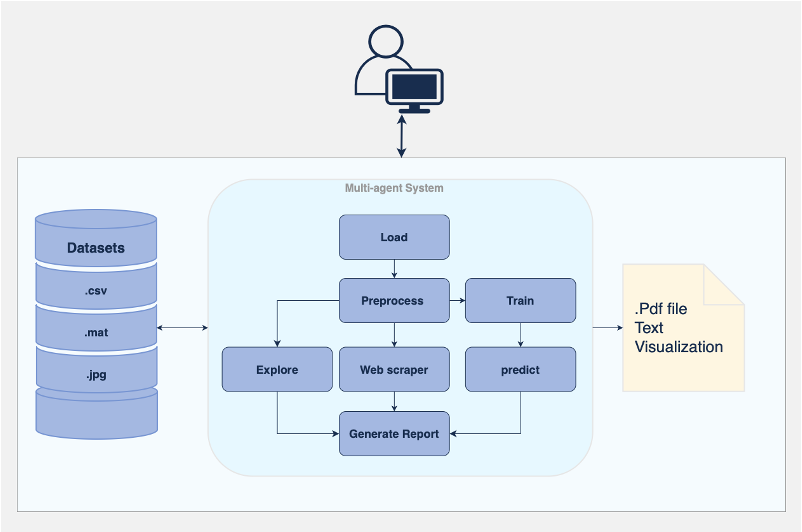

# SpillSense

> **SpillSense** is an AI-powered multi-agent system for analyzing oil spill data across image, CSV and MAT formats—delivering automated reports, visualizations and model metrics via an intuitive chat interface.
>
> 
<table>
  <tr>
    <td></td>
    <td></td>
  </tr>
  <tr>
    <td></td>
    <td></td>
  </tr>
</table>


## Table of Contents

1. [Features](#features)  
2. [Architecture](#architecture)  
3. [Getting Started](#getting-started)  
   - [Prerequisites](#prerequisites)  
   - [Installation](#installation)  
   - [Environment Variables](#environment-variables)  
4. [Usage](#usage)  
   - [Running the Pipelines](#running-the-pipelines)  
   - [Starting the Frontend](#starting-the-frontend)  
5. [Project Structure](#project-structure)  
6. [Screenshots](#screenshots)  
7. [Contribution](#contribution)  
8. [License](#license)  
9. [Contact](#contact)  

---

## Features

- **Multi-format ingest**: `.jpg` images, `.csv` sensor data, `.mat` hyperspectral files  
- **Preprocessing & Cleaning**: generic & domain-specific cleaners  
- **Exploration & Visualization**: auto EDA, color labeling, scene processing  
- **Model Training & Inference**: decision trees, logistic regression, random forests, SVM, custom pipelines  
- **Automated Reporting**: PDF/text reports with results & metrics  
- **Web-scraping**: enrich reports with recent news & contextual data  
- **Chat Interface**: React-based UI for uploads, commands & sidebar downloads  

---

## Architecture


A multi-agent backend orchestrates Load → Preprocess → Train/Infer → Report, while a React frontend delivers a seamless chat and download experience.

---

## Getting Started

### Prerequisites

- Python 3.8+  
- Node.js 16+ & npm  
- (Optional) Conda for environment management  

### Installation

```bash
# Clone repo
git clone https://github.com/your-org/spillsense.git
cd spillsense

# Python backend
python -m venv venv
source venv/bin/activate
pip install -r requirements.txt

# Frontend
cd frontend
npm install


# Backend
OPENAI_API_KEY=your_openai_key
NEWS_API_KEY=your_news_key

# Frontend
REACT_APP_BACKEND_URL=http://localhost:8000


# Ingest & clean data
python auto_ingest.py --input-folder data/

# Run full modeling pipeline
python run_phase1.py
python run_image_modeling.py
python run_modeling.py

# Perform inference
python predict_image.py --image path/to/oil.jpg
python predict_new_batch.py --csv data/sensor.csv


cd frontend
npm start
# opens http://localhost:5173 where you can upload files and chat

```
## Contribution

Thank you for considering contributing to SpillSense! We welcome all kinds of contributions—code, documentation, bug reports, feature requests, or simply spreading the word.

1. 🎯 **Pick an issue**  
   - Check our [issues page](https://github.com/your-org/spillsense/issues) for labeled “good first issue” or “help wanted.”  
   - If you don’t find something, open a new issue to discuss your idea or bug.  

2. 🍴 **Fork & branch**  
   ```bash
   git clone https://github.com/your-org/spillsense.git
   cd spillsense
   git checkout -b feat/your-feature
```

