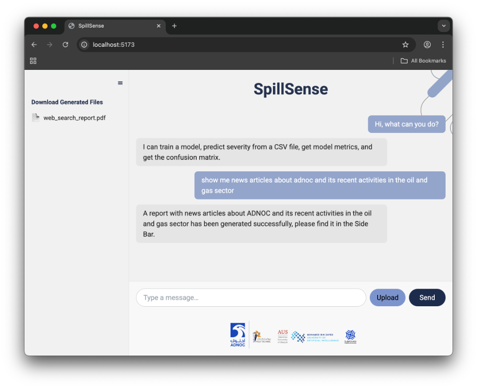
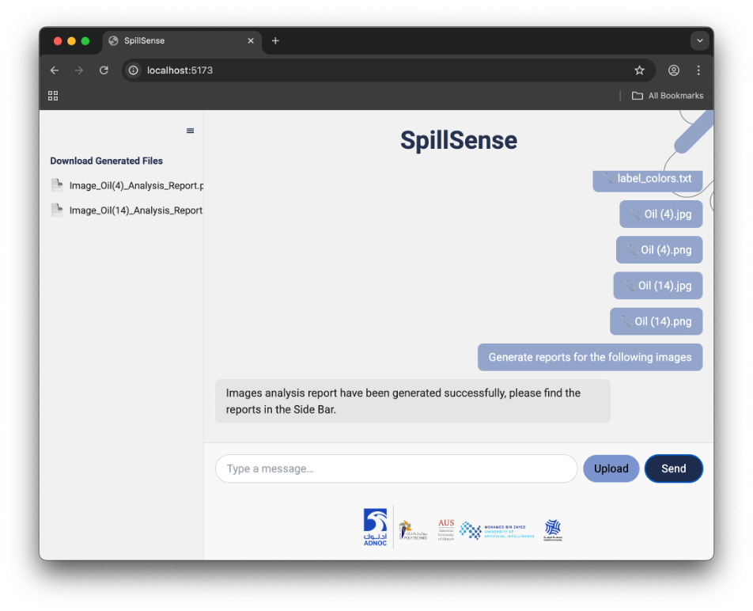
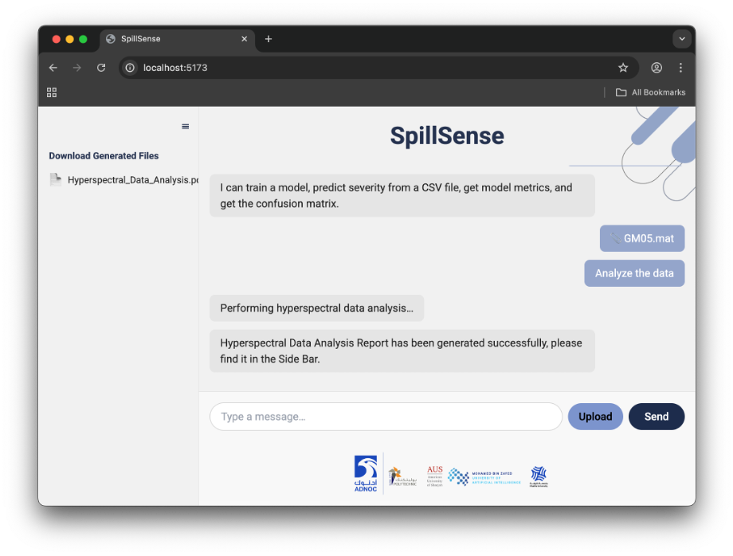
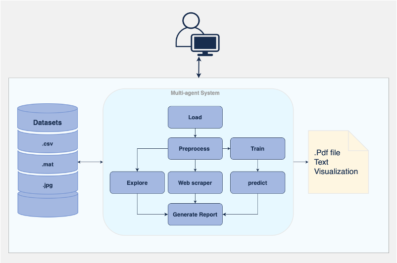

# SpillSense

> **SpillSense** is an AI-powered multi-agent system for analyzing oil spill data across image, CSV, JPG and MAT formats—delivering automated reports, visualizations and model metrics via an intuitive chat interface.
>
> 
<table>
  <tr>
    <td></td>
    <td></td>
  </tr>
  <tr>
    <td></td>
    <td></td>
  </tr>
</table>


## Table of Contents

1. [Features](#features)  
2. [Architecture](#architecture)  
3. [Getting Started](#getting-started)  
   - [Prerequisites](#prerequisites)  
   - [Installation](#installation)  
   - [Environment Variables](#environment-variables)  
4. [Usage](#usage)  
   - [Running the Pipelines](#running-the-pipelines)  
   - [Starting the Frontend](#starting-the-frontend)  
5. [Project Structure](#project-structure)  
6. [Screenshots](#screenshots)  
7. [Contribution](#contribution)  
8. [License](#license)  
9. [Contact](#contact)  

---

## Features

- **Multi-format ingest**: `.jpg` images, `.csv` sensor data, `.mat` hyperspectral files  
- **Preprocessing & Cleaning**: generic & domain-specific cleaners  
- **Exploration & Visualization**: auto EDA, color labeling, scene processing  
- **Model Training & Inference**: decision trees, logistic regression, random forests, SVM, custom pipelines  
- **Automated Reporting**: PDF/text reports with results & metrics  
- **Web-scraping**: enrich reports with recent news & contextual data  
- **Chat Interface**: React-based UI for uploads, commands & sidebar downloads  

---

## Architecture


A multi-agent backend orchestrates Load → Preprocess → Train/Infer → Report, while a React frontend delivers a seamless chat and download experience.

---

## Getting Started

### Prerequisites

- Python 3.8+  
- Node.js 16+ & npm  
- (Optional) Conda for environment management  

### Installation

```bash
# Clone repo
git clone https://github.com/your-org/spillsense.git
cd spillsense

# Python backend
python -m venv venv
source venv/bin/activate
pip install -r requirements.txt

# Frontend
cd frontend
npm install


# Backend
OPENAI_API_KEY=your_openai_key
NEWS_API_KEY=your_news_key

# Frontend
REACT_APP_BACKEND_URL=http://localhost:8000


# Ingest & clean data
python auto_ingest.py --input-folder data/

# Run full modeling pipeline
python run_phase1.py
python run_image_modeling.py
python run_modeling.py

# Perform inference
python predict_image.py --image path/to/oil.jpg
python predict_new_batch.py --csv data/sensor.csv


cd frontend
npm start
# opens http://localhost:5173 where you can upload files and chat

```
## Contribution

Thank you for considering contributing to SpillSense! We welcome all kinds of contributions—code, documentation, bug reports, feature requests, or simply spreading the word.

1. 🎯 **Pick an issue**  
   - Check our [issues page](https://github.com/your-org/spillsense/issues) for labeled “good first issue” or “help wanted.”  
   - If you don’t find something, open a new issue to discuss your idea or bug.  

2. 🍴 **Fork & branch**  
   ```bash
   git clone https://github.com/your-org/spillsense.git
   cd spillsense
   git checkout -b feat/your-feature

### Environment Variables

Before you run SpillSense, you need to create a `.env` file in the project root and populate it with your own service credentials and database settings. Here’s a template and explanations for each variable:

```dotenv
# Frontend
VITE_BACKEND_URL=http://localhost:8000

# Google Generative Language
GOOGLE_API_KEY=        # Your Google Cloud API key
GEMINI_API_ENDPOINT=https://generativelanguage.googleapis.com/v1beta/models

# Database (MySQL)
DB_HOST=               # e.g. localhost or your DB server address
DB_USER=               # e.g. spillsense_user
DB_PASSWORD=           # your secure DB password
DB_NAME=               # e.g. spillsense_db

# News API (GNews)
GNEWS_API_KEY=         # Your GNews API key
```

## Database Setup

After you’ve created your `.env` file with the required DB credentials (see [Environment Variables](#environment-variables)), initialize your MySQL schema by running the provided `setup_db.py` script.

### 1. Install the dependencies

Make sure you have `mysql-connector-python` and `python-dotenv` installed in your backend virtual environment:

```bash
pip install mysql-connector-python python-dotenv
```

## Verify your .env
Your .env (in the project root) should include something like:
```bash
DB_HOST=localhost
DB_USER=spillsense_user
DB_PASSWORD=your_password
DB_NAME=spillsense_db
```

## Run the setup script
From the project root (where setup_db.py lives):

```bash
python setup_db.py
```

## This will:
Connect to your MySQL server using the credentials in .env
Create the following tables if they do not already exist:
files_metadata
scan_results
scene_metadata
file_catalog
link_table


You should see output like:

```bash
Creating table `files_metadata`... OK ✅
Creating table `scan_results`... OK ✅
Creating table `scene_metadata`... OK ✅
Creating table `file_catalog`... OK ✅
Creating table `link_table`... OK ✅
```


## If you encounter an error:
Invalid credentials: Check your .env values.
Database does not exist: Create the database manually first:

```bash
CREATE DATABASE spillsense_db;
```
then rerun python setup_db.py.
